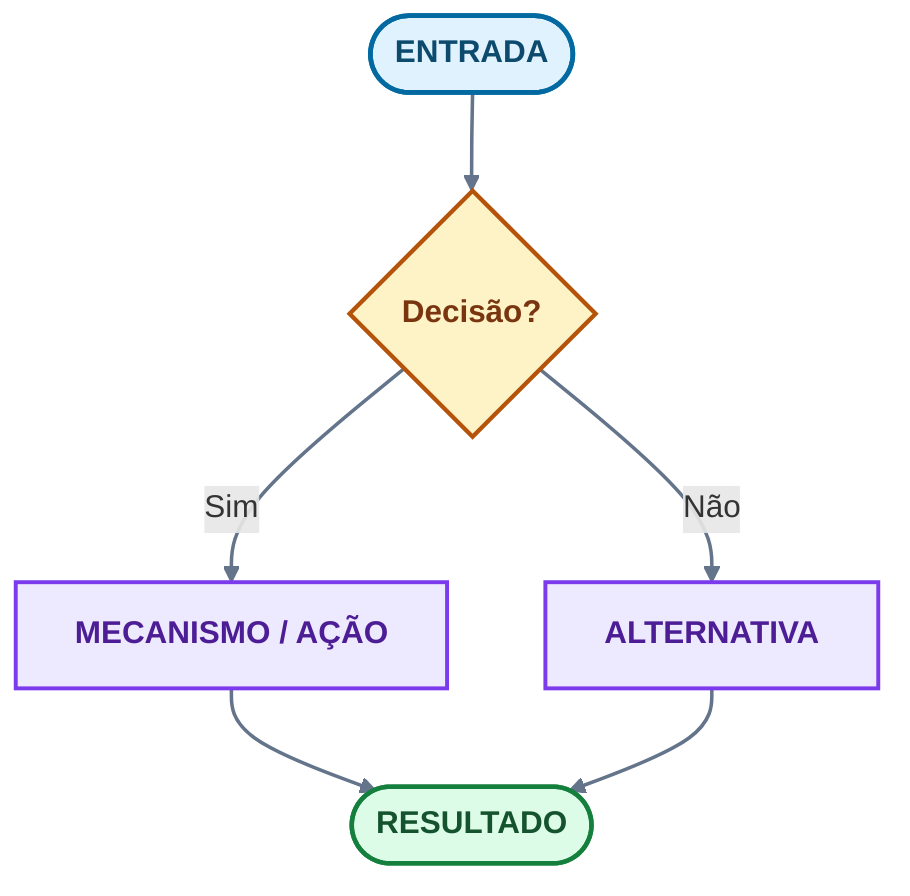

# ⌘ Manual Extenso · Preferências no Craft

*Editorial · Unicode · Tabelas · Mermaid · LaTeX/KaTeX · MCP*

**Exportação Markdown do documento Craft vivo.** Destino canónico: space **⌕ TUT**, pasta **How to use Craft**, bloco `8db4e12c-f306-4551-49c6-9d7e5fbd5c63`.  
Se este ficheiro divergir do Craft, **Craft vence**. Atualize in place; não crie V2.

> **MANUAL PERSISTENTE · PREFERÊNCIAS DE EDIÇÃO NO CRAFT** — Documento genérico e reutilizável: orienta qualquer pessoa ou IA a criar, revisar e reorganizar notas no Craft neste padrão — editorial, visual, Mermaid e LaTeX. Vale para qualquer tema (não só Medicina). Em conflito, valem: **verdade > beleza**, **zero-loss** e **português impecável**.

Escopo: preferências duradouras e genéricas (qualquer tema). Consolidado a partir do Manual para IAs, do Manual Geral Canónico, da memória editorial e das falhas já pagas em notas reais. Espelho git: este ficheiro.

Manuais irmãos (não substituir):

- [Manual Geral Canónico](block://0360ff09-4827-0f41-8638-f3304dd9cf40) — porta curta
- [Manual para IAs](block://04025d1f-39e1-2fd3-2134-93280c6ccf06) — enciclopédia Mermaid
- [Demonstração LaTeX/KaTeX](block://2b2e76d6-56c0-3eb0-e48a-186828f1b3ff) — labs de fórmula

**Como ler**

- §§1–5: princípios, escolha de meio, visual, Mermaid, LaTeX
- §§6–10: unicode, qualidade, hierarquia, cards versus toggles, repertório anti-tofu
- §§11–17: tabelas, mermaid operacional, LaTeX, imagens, organização, MCP, contraste
- §§18–22: persistência, zero-loss, anti-padrões, checklist, mapa TUT
- §§23–29: apêndices MCP (newline/GFM, imagens, 502, lixeira, mutação, IDs, hiperligações)

Edição: 13/09/2026. Numeração dos apêndices regularizada nesta cópia (no Craft alguns H2 repetiam 8 / 9 / 18 / 19).

---

## 1 · Direção editorial · princípios inegociáveis

- **Verdade antes da beleza.** Nenhum ganho visual justifica erro conceitual, inversão de relação, remoção de exceção ou ocultação de incerteza.
- **Zero-loss.** Preservar integralmente o conhecimento válido. Não mover fontes para a lixeira sem confirmar backlinks, anexos, imagens, versão mais recente e equivalência.
- **Português brasileiro impecável.** Acentos, crase, regência, concordância, siglas, unidades e intervalos corretos. A redação canónica vem antes do código; o parser não tem autoridade para impor ortografia errada.
- **Refatorar in place.** Uma nota-mãe canónica por tema; evitar V2/V3 concorrentes; corrigir o bloco canónico em vez de duplicar.
- **Função antes de ornamento.** Cor, forma e posição são semânticas e redundantes com o rótulo — nunca decoração.
- **Mobile-first.** Projetar para 320–430 px de largura.
- **Testar no Craft real.** Todo recurso frágil precisa de fallback em texto, tabela ou microdiagrama.

---

## 2 · Arquitetura da informação · quando usar cada recurso

| Objetivo | Recurso preferido |
| --- | --- |
| Nuance, argumento, explicação | Texto estruturado |
| Poucos itens sem relação | Lista |
| Comparação célula a célula | Tabela nativa |
| Processo, decisão, estado, sequência | Mermaid |
| Fórmula, escore, relação compacta | LaTeX (`math_formula`) |
| Posição espacial real | Imagem legendada |
| Alerta, definição, critério | Callout semântico |
| Conteúdo progressivo | Toggle de texto |
| Ambiente autónomo | Card (`type: page`) |
| **Regra de ouro** | Se o recurso custa mais que o texto, redesenhar ou abandonar. |

---

## 3 · Sistema visual do Craft

Estilo de página (aplicável por bloco de página): defina identidade com tema, fonte, separador, washi, backdrop e capa — sempre a serviço da leitura, nunca só estética.

| Elemento | Preferência |
| --- | --- |
| Tema | Claro por padrão. `prism` ou `techy` em notas técnicas. Uma família por nota-mãe. |
| Fonte | **system-rounded** em notas técnicas; **system-serif** em long-form; mono só em código. |
| Separador | **washi** (`hex` conexões, `wave` fluxo, `stripe` urgência, `dot` revisão). `line` quando sóbrio. |
| Backdrop | Gradiente suave do eixo; `none` quando o foco é texto. |
| Capa | Hero abstrata, coerente com o eixo. |
| Cards | `card` regular/large para secções autónomas; `small` só em subcards. |
| Cor adaptativa | `#claro #escuro` (ex. `#2563EB #93C5FD`). Contraste WCAG ≥ 4,5:1. |

### Cores de highlight · uso semântico

A cor é **redundante** com rótulo, posição e forma — nunca a única portadora de significado.

| Highlight nativo | Papel semântico |
| --- | --- |
| `blue` / `gradient-blue` | Navegação / definição |
| `purple` / `gradient-purple` | Mecanismo / síntese |
| `mint` | Evidência / validado |
| `green` | Resultado concreto |
| `yellow` / `gradient-yellow` | Decisão / critério |
| `cyan` | Cautela / transversal |
| `red` / `gradient-red` | Urgência / erro |
| `pink` | Eixo secundário |
| `gradient-brown` | Governança / acervo |
| `gray` | Metadado |

O MCP **rejeita** highlight `orange` e `brown` simples. HEX arbitrário no highlight nativo também é recusado — cor customizada vive no mermaid `classDef`.

### Callouts semânticos · modelos

> **INFORMAÇÃO** — Contexto, definição ou compatibilidade.

> **DECISÃO** — Critérios, escolhas e limitações.

> **VALIDADO** — Apenas quando houver teste ou evidência concreta.

> **URGÊNCIA / ERRO** — Ameaça tempo-dependente, armadilha ou bloqueio.

> **GOVERNANÇA / ACERVO** — Proveniência, preservação e regras de “não excluir”.

**Toggles e cards.** Use `+ Toggle` para conteúdo progressivo (filhos sempre indentados como `  - item`, nunca colados à esquerda). Use cards (sub-páginas) para blocos temáticos autónomos; `>` (quote) para leituras/notas de rodapé curtas.

---

## 4 · Mermaid no Craft

> **CAMADAS DE COMPATIBILIDADE** — **Núcleo seguro no Craft:** flowchart, state, sequence, class, ER e `xychart-beta`. **Testar antes de publicar:** Gantt, gitgraph, journey, quadrant, mindmap, timeline, Sankey e recursos recém-lançados. **Frágil (testar sempre):** HTML em rótulos, Markdown strings, ícones/imagens, clique/callback, CSS externo, frontmatter. Não confundir sintaxe oficial do Mermaid com o suporte do renderer do Craft.

### Silhueta e leitura (mobile-first)

- Projetar para **320–430 px**; mirar proporção **4:5** (aceitar 4:3 com paralelismos reais).
- **TB/TD** para triagens, árvores e rótulos largos; **LR** apenas para cadeias curtas e paralelismos genuínos.
- Evitar **torres** com mais de 5–6 níveis e pôsteres com mais de ~12–15 nós; agrupar, abrir faixa curta ou repartir em microdiagramas.
- Um nó = uma ideia; usar `<br/>` para 2–3 linhas curtas, não para alongar altura.

### Família geométrica dominante

Escolha **uma** família por diagrama: **retilínea/angulosa** para protocolos, triagens, regras e validações; **arredondada/orgânica** para mapas conceptuais, históricos e interpretativos. O **losango é exceção semântica** — só decisão real. Não alternar retângulo/arredondado/stadium sem função.

### Paleta semântica · `classDef` (claro)

| Papel | fill | stroke | color |
| --- | --- | --- | --- |
| Âncora / entrada | `#E0F2FE` | `#0369A1` | `#0C4A6E` |
| Mecanismo / processo | `#EDE9FE` | `#7C3AED` | `#4C1D95` |
| Decisão | `#FEF3C7` | `#B45309` | `#78350F` |
| Urgência / erro | `#FEE2E2` | `#B42318` | `#7A271A` |
| Resultado / validado | `#DCFCE7` | `#15803D` | `#14532D` |
| Linha-base (`linkStyle`) | `#64748B` | 1.8 px | tracejado no retorno |



*Como ler:* o losango é a única decisão; o violeta explica o mecanismo; o verde é o resultado. IDs ASCII; português nos rótulos.

> **GATE DE QUALIDADE (MERMAID)** — Antes de manter: sintaxe válida no Craft real, uma família geométrica, paleta semântica com contraste em claro/escuro, proporção ≈ 4:5, rótulos curtos, sem cruzamentos inúteis e **read-back** confirmando persistência. Persistência ≠ render visual: não reivindique que o aluno vê o diagrama sem inspeção no app. Se ficar mais difícil que o texto, redesenhar, modularizar ou abandonar.

### Contrato operacional · IDs, dual-mode e linkStyle

- IDs ASCII (`n1`, `decisao_1`). UTF-8 só no rótulo.
- Quebra dentro do rótulo = `<br/>`. Nunca os dois caracteres barra + n dentro do nó.
- Losango `{ }` só para decisão real (pergunta com pelo menos dois ramos).
- Todo nó recebe `class` de papel. Não deixar nó nu no meio de um grafo classificado.
- `classDef` traz fill + stroke + color juntos e opacos. HEX **não** segue o tema do Craft.
- Dual-mode: fundo do bloco `--bg-color "#F8FAFC #0F172A"` + chips opacos. Verificar claro e escuro.
- Contraste WCAG ≥ 4,5:1 no par fundo/texto do chip.
- `linkStyle` só depois da topologia estável — os índices mudam quando se insere uma aresta.
- Sem HTML cru, sem `click` / callbacks, sem frontmatter barroco.
- Descrição textual equivalente imediatamente abaixo.
- Validar no playground estático e depois no Craft (claro, escuro, estreito).

---

## 5 · LaTeX no Craft (`math_formula`)

O Craft renderiza LaTeX em blocos de código com a linguagem **`math_formula`**. Dois usos: (1) **fórmulas e notação** (frações, índices, operadores, unidades) e (2) **painéis visuais** de decisão/escore — blocos coloridos e emoldurados que funcionam como fallback quando uma imagem não é viável.

### Tokens mais usados

| Token | Uso |
| --- | --- |
| `\begin{gathered} … \end{gathered}` | Empilhar linhas centralizadas |
| `\\[Npt]` | Quebra de linha com espaço vertical |
| `\color{#hex}{…}` | Cor semântica (mesma paleta) |
| `\boxed{…}` | Caixa de realce |
| `\text{…}` e `\text{\large …}` | Texto com acentos e tamanho |
| `\mathbf{…}` | Negrito |
| `\rule{Wpt}{Hpt}` | Régua/divisória |
| `\Downarrow` , `\longrightarrow` | Setas de fluxo |
| `\le \ge \times \pm` | Operadores |
| `+3{,}0` | Vírgula decimal (chaves protegem o espaçamento) |
| `\; \, \quad \qquad` | Espaçamentos crescentes |

> **CUIDADOS (LaTeX)** — acentos vão dentro de `\text{…}` (ou direto no rótulo); use vírgula decimal com `{,}`; reutilize a paleta semântica nas cores `\color{#hex}`; teste em claro/escuro e no iPhone; painéis são recurso de exceção — legibilidade acima do enfeite.

### Exemplos · fórmula e painel

```math
\begin{gathered}
DC = VS \times FC \qquad PA = DC \times RVS \\[6pt]
FE = \dfrac{VS}{VDF} \qquad t_{\mathrm{porta\text{-}balão}} \le 90\,\mathrm{min}
\end{gathered}
```

```math
\begin{gathered}
\color{#4338CA}{\boxed{\;\mathbf{\text{PAINEL DE DECISÃO}}\;}}\\[12pt]
\color{#0284C7}{\mathbf{\text{ENTRADA}}}\ \longrightarrow\ \text{avaliar critério}\\[8pt]
\color{#D97706}{\Downarrow}\\[8pt]
\color{#059669}{\boxed{\text{RESULTADO: conduta validada}}}
\end{gathered}
```

No Craft, a cerca é `math_formula`, não `math`.

### Fallback LaTeX em três níveis

- **Nível A — renderizado:** usar quando o Craft/KaTeX confirmar a expressão.
- **Nível B — simplificado:** remover comandos frágeis sem alterar a relação.
- **Nível C — linear em português:** ler a fórmula em prosa e definir variáveis.

A fórmula nunca é a única forma de transmitir o essencial. Variáveis explicadas **fora** da fórmula. Comandos portáteis KaTeX apenas. Fórmula compacta ao lado do núcleo; pôster largo vai para lab/card. Não usar LaTeX como tabela, fluxograma ou anatomia — o painel visual desta secção é **exceção**, não o default.

---

## 6 · Unicode, língua e marcas de texto

Preservar acentos, crase, regência, siglas, unidades e intervalos (“não”, “decisão”, “Cl⁻”, “PaO₂/FiO₂”, “≥ 48 h”, “48–72 h”). Separar **IDs ASCII técnicos** dos **rótulos UTF-8 visíveis**. Usar Unicode apenas quando **funcional**, curto, normalizado em **NFC** e validado em claro, escuro, busca, cópia e iPhone. Nunca remover diacríticos nem misturar alfabetos estilizados para reconstruir palavras; evitar emoji pictográfico, seletores de variação, espaços invisíveis e símbolos sem função.

### Marcas de texto (≠ emoji)

| Marca | Significado |
| --- | --- |
| `⌘` | método / como pensar |
| `◇` | item recuperável / questão |
| `▸` | gabarito / resposta |
| `☑︎` / `☒` | feito / não feito |
| `⚠︎` | alerta / cautela |
| `✦` | destaque / rota |
| `⌕` | aprofundamento / busca |
| `◆` / `⊙` | síntese / índice |
| `⌁` | fluxo / conexão |

> **LEGADO vs REPERTÓRIO SEGURO** — Em **notas novas**, vale a tabela do §10: sem CJK (`〤 〴 〄`), sem Wancho, sem tofu. Na rota UCT já publicada, **〤** (U+3024) permanece até eleição — não misturar com 〴 nem “corrigir” à força. ⚡︎ ☑︎ ☒ ⚑ só se passarem no teste do glifo (claro, escuro, iPhone, busca). Uma marca por nota-mãe.

---

## 7 · Processo de qualidade

Ciclo obrigatório: **ler** → **diagnosticar** → **manter / corrigir / refatorar / criar** → **persistir** → **reler (read-back)** → **comparar** → **validar** → **avançar**.

- Antes de editar: inventariar nós, relações, rótulos, ordem, exceções, legenda, cores e dependências.
- Depois de cada onda: read-back do bloco e dos vizinhos, checando truncamento, duplicação, compatibilidade, contraste, acessibilidade e ausência de regressão.
- Testar no **Craft real**, não só em editor externo; todo recurso frágil precisa de fallback.

> **GANHO LÍQUIDO** — Uma nova versão só permanece se houver ganho demonstrável em clareza, mobile, acessibilidade, manutenção, sintaxe ou modelo mental. Caso contrário, reverter.

---

## 8 · Hierarquia de leitura

Título da página = H1 implícito. `##` = uma unidade de sentido. `###` só se o H2 tiver três ou mais núcleos distintos. Síntese de 1–3 frases no topo da secção, depois **um** objeto principal (tabela, Mermaid, LaTeX ou imagem), depois “como ler” / critério. Aprofundamento em card ou toggle — nunca no sítio do núcleo.

- Uma secção = um H2 + síntese + um objeto principal.
- Não empilhar três H2 sem prosa entre eles.
- Não usar H3 como enfeite.
- Núcleo de 60 s **antes** de atlas, fontes e labs.
- Listas com mais de 8 itens viram tabela ou cards temáticos.

---

## 9 · Cards, toggles e o toggle falso

### Card / página aninhada

Use quando o bloco tem **vida própria**: atlas, bateria, lab, dump histórico, apêndice. O leitor abre, estuda, fecha. O chevron do Craft **não é toggle de texto** — é navegação para subpágina (`type: page` + `textStyle: card`).

### Toggle de texto

Use quando o conteúdo é continuação da mesma linha de leitura e deve poder fechar-se: passo a passo, gabarito, nota longa.

Sintaxe MCP (obrigatória):

```
+ Toggle título
  - filho no recuo 1
    - neto no recuo 2
```

- Filho alinhado à esquerda vira bloco solto **fora** do toggle.
- U+2028 dentro de toggle nativo é Craft — o parser não “corrige”.

### Perguntas de estudo

Pergunta = toggle de enunciado + sub-toggle de gabarito. Não usar card para uma pergunta de uma linha. Não usar toggle para um atlas de 20 figuras.

```
+ Enunciado da pergunta
  - contexto mínimo (opcional)
  + ▸ Gabarito
    - resposta
    - critério de correção
```

### Anti-padrões de contentor

- Card cujo único filho é um parágrafo.
- Toggle cujo título é um H2 e o corpo está vazio.
- Página TEMP / MASTER restaurada da lixeira “para consertar a busca”.

### Tabela rápida · card versus toggle

O título da página já é o H0. O corpo começa com síntese, não com um segundo título redundante. **H2** para movimento grande; **H3** para procedimento, exemplo ou exceção. Uma ideia por bloco.

| Precisa de… | Use |
| --- | --- |
| Ambiente autónomo (bateria, atlas, aprofundamento, fontes) | **Card** (`type: page` + `textStyle: card`) |
| Expandir no lugar (pergunta, detalhe, gabarito) | **Toggle de texto** (`listStyle: toggle`) |

> **TOGGLE FALSO É PROIBIDO.** Página com chevron que abre subpágina em vez de expandir. Cards **não** levam `listStyle: toggle`.

- Filhos sempre indentados: `  - item` no recuo 1; netos no recuo 2.
- Texto colado à esquerda depois de `+ Toggle` esvazia o toggle.
- Sub-toggle de revelação: título `▸` no recuo 1; resposta no recuo 2.
- Pergunta curta: pergunta no título; resposta no recuo 1.

---

## 10 · Unicode · repertório seguro (anti-tofu)

Preferência: **marcas de texto**, não emoji colorido. Só entram glifos que o Craft renderiza sem quadrado (tofu) em claro, escuro e iPhone.

| Função | Usar | Não usar |
| --- | --- | --- |
| Estrutura e navegação | `⌁ ⌕ ◇ ◆ ⊹ ⊙ ↳ →` | CJK (`〤 〴 〄`), APL (`⌯ ⌿`), Dogra, Linear B, PUA |
| Estado textual | `☑︎ ☒ ⚠︎` | Emoji pictográfico |
| Gabarito / revelar | `▸` | Chevron de página |
| Item recuperável | `◇` | `〤` (Hangzhou; tofu em fonte latina) — **exceto legado UCT**, §6 |
| Síntese / índice | `◆` ou `⊙` | `⌯ ⳹` e alfabetos raros |
| Marca da nota-mãe | `✦` se renderizar; senão `◆` | Mathematical bold |
| Lógica no texto | `≠ ≤ ≥ ± ∴ → ←` | Bloco U+1D400 |
| Ciência | `Cl⁻ O₂ 16 °C` (NFC) | Fullwidth, espaços invisíveis |

### Proibições duras

1. **Mathematical Alphanumeric Symbols** (U+1D400–U+1D7FF). Não são fonte. Quebram busca, cópia, acento e Mermaid. Use latim + `**negrito**` / `*itálico*` / `classDef`.
2. **Mistura rejeitada:** letra matemática + acento latino na mesma palavra.
3. **Seletores de variação imprevisíveis.** Manter `☑︎ ☒ ⚠︎`. Não espalhar `U+FE0E` em `⚡ ⚙`.
4. **Private Use**, Linear B, Brahmi, Dogra, Wancho, lookalikes.
5. **Lookalikes no JSON.** Restaurar pelo codepoint; se o canónico for tofu, **trocar o canónico** pelo repertório seguro.

> **TESTE DO GLIFO** — Entra só se (a) aparece sem quadrado; (b) copiar/buscar/editar não alteram a palavra; (c) o fallback remove estilo, não informação. Prefira NFC precomposto.

---

## 11 · Tabelas nativas

Toda comparação célula a célula vira **tabela nativa**. Não pipe solto em parágrafo, não `\n` literal, não `U+2028` no lugar da linha.

- Cabeçalho em highlight `yellow` (ou cor do eixo) + **negrito**.
- Primeira coluna (termo, sigla, critério) em **negrito**.
- Coluna de eixo / estado / gravidade com highlight semântico: urgência `red`; validado `mint`; governança `gradient-brown`; mecanismo `purple`; definição `blue`; metadado `gray`; transversal `cyan`; escore `yellow`.
- *Itálico* só na expansão/glossário.
- Não existe highlight `orange` nem `brown` simples — o MCP rejeita.
- Contraste pleno: texto escuro sobre fill claro.
- Tabelas enormes: partir por faixa (A–C, D–G).
- Se o update falhar em tabela aninhada, não destruir; formatar o mutável.

O `--markdown` precisa de **newline real** entre as linhas. `\n` literal quebra (*Markdown must contain exactly one table*).

---

## 12 · Mermaid · IDs, descrição, dual-mode e anti-padrões

Complementa o §4. Método: (1) escrever a pergunta visual; (2) extrair nós e exceções; (3) **IDs ASCII** + rótulos em português UTF-8, sem Mathematical Alphanumeric; (4) começar sem estilo; acima de ~15 nós, modularizar; (5) `classDef` = papel cognitivo, fill + stroke + color juntos; (6) `linkStyle` **depois** da topologia, índices 0-based; (7) descrição textual equivalente **obrigatória**.

| Aresta | stroke |
| --- | --- |
| Sim / sucesso | `#16A34A` |
| Urgência | `#DC2626` |
| Cautela | `#EA580C` |
| Integração | `#4F46E5` |
| Default | `#64748B` |

Dual-mode e renderer:

- Fundo do bloco `--bg-color "#F8FAFC #0F172A"` quando o Craft aceitar.
- Chips **opacos**. Texto escuro em fill claro. WCAG ≥ 4,5:1.
- HEX de `classDef` **não** acompanha o tema do Craft sozinho.
- Persistência JSON (`language: mermaid`) ≠ prova visual no app.
- Se acento quebrar aquele bloco: ASCII no rótulo + português correto na descrição.

> **ANTI-PADRÕES MERMAID** — Torre ilegível; fundo escuro + texto escuro; acento reescrito como letra matemática; `end` colado em `o`/`x`; HTML/callback; `linkStyle` antes de reordenar arestas; losango em nó que não decide; diagrama sem descrição equivalente.

---

## 13 · LaTeX/KaTeX · inline, fallback e limites

Complementa o §5. **LaTeX** é a linguagem; **KaTeX** é o renderer (subconjunto). Comando válido no TeX completo **não** garante Craft.

| Situação | Forma |
| --- | --- |
| Símbolo ou relação curta | Inline `$...$` |
| Derivação, sistema, fórmula central | Bloco `math_formula` |
| Algoritmo / ramificação | Mermaid, não LaTeX |
| Tabela de atributos | Tabela nativa, não `array` gigante |
| Anatomia / traçado | Imagem, não TikZ |

- **A** — renderizada, se o Craft confirmar.
- **B** — simplificada, sem mudar a relação.
- **C** — leitura linear (“pressão = força dividida pela área”).
- A fórmula **nunca** é a única forma de um conteúdo essencial.
- Variáveis, unidades, domínio e ressalva ficam **fora** da fórmula.
- Prefira comandos portáveis: fração, índice, expoente, raiz, limite, `mathrm`, `text`, `aligned`.
- Evite pacotes, macros pessoais, CSS, HTML, ambientes não testados.
- Pôster LaTeX largo: não duplicar nem apagar; não é o padrão novo.

Exemplo inline: a taxa de $x^{2}$ é $f'(x)=2x$. Fallback C: a taxa de variação de x² no ponto x é 2x.

---

## 14 · Imagens

- Entram **no ponto de leitura** (depois do caso, antes das alternativas) — não no fim do card.
- `alt` descritivo, sem entregar gabarito quando a figura for de questão.
- Uma frase **Como ler:** o que olhar, sem spoiler.
- Didático ≠ exame real. Não substituir ECG/RX/biópsia por desenho gerativo.
- Colapsar duplicatas: 1 figura + legenda.
- Upload persistente (`uploaded: true` + URL `r.craft.do`). Read-back do bloco `image`.
- Proveniência quando não for original.
- PNG transparente só quando o recorte exigir. Proporção 4:5 em pranchas mobile quando couber.

---

## 15 · Organização do ambiente

- **Nota-mãe canónica por tema/UCT:** escopo, mapa de cobertura, status, rotas de entrada, fontes preservadas, pendências e ligações para filhas. Refatorar in place; nada de V2/V3.
- **Acervo = camada de preservação:** PDFs, lotes crus e imports permanecem (“não excluir”); só o conteúdo **curado** é incorporado às notas.
- **Incorporar por tipo:** exposição → SP; revisão → ✓ REVISÃO; recall/questões → Master; síntese/casos → Síntese.
- **Ciclo INCORPORAR → ELEGER → EXCLUIR:** eleger à exclusão só com 100% nativo; excluir de facto só sem dúvida (lixeira, 30 dias), confirmando backlinks/anexos/versão.

---

## 16 · Operação via IA/MCP no Craft

- **Vários blocos de uma vez:** `blocks add --id <page> --json [ {...}, {...} ]` (um objeto por bloco). Lida bem com aspas, `;` e quebras; prefira ao `--markdown` quando houver caracteres especiais.
- **Remover sub-página de um card:** `blocks delete --id <childId>`. Atenção: `documents delete` manda o documento à lixeira, mas **não** remove o bloco-filho do card.
- **Mover nativo entre cards:** `blocks move --id <block> --targetId <page> --position end` — zero-loss e reversível.
- **Batch com `;`** só quando o conteúdo não contiver `;`.
- **Read-back sempre.** O `context/preview` às vezes mostra tabela vazia (artefacto) — confirme lendo o bloco.
- **LaTeX/Mermaid via `--json`:** escapar barra, aspas e quebras; evitar codepoints astrais `\u{...}` (JSON só aceita `\uXXXX`); validar por read-back.
- **IDs:** `rootBlockId` ≠ `documentId`; resolver o link antes de operar.

> **MANUTENÇÃO** — Origem: Manual para IAs + memória editorial + convenções das notas UCT. Atualize este manual **in place**; tudo é reversível por histórico/lixeira (30 dias). Este documento é genérico e serve para qualquer tema.

---

## 17 · Contraste e harmonia

Uma paleta por nota-mãe. Papéis estáveis em toda a rota.

- Texto sobre highlight: escuro em fill claro.
- Mermaid: fill + stroke + color sempre juntos; nunca texto `#0F172A` em canvas `#0F172A`.
- Dual-mode de página: `textColor` e `backgroundColor` no formato `#claro #escuro`.
- Verificar tema claro, escuro e — quando possível — iPhone.
- Highlight só onde muda a leitura (eixo, decisão, urgência, estado). Sem papagaio cromático.
- Washi na cor do eixo, não aleatória.

---

## 18 · MCP, persistência e read-back

- Ler o bloco vivo (`blocks get`) **antes** de editar.
- Mutação mínima no bloco canónico.
- `--markdown` com newline real. `\n` literal quebra tabela e toggle.
- Depois de `+ Toggle`, filhos como `  - item`.
- Muitos updates: um `--json` array, ou um bloco por chamada se o lote estourar timeout.
- `blocks get` de novo. Conferir vizinhos se a hierarquia mudou.
- Documento na lixeira: restaurar antes de editar. Não editar casca vazia.
- Não declarar “renderizou no app” sem inspeção visual. A API só prova persistência.
- `rootBlockId` ≠ `documentId` da URL. Resolver link antes de escrever.
- Não inventar lookalike de Unicode na hora de digitar. Codepoint explícito ou ficheiro UTF-8.

---

## 19 · Zero-loss e governança

1. **Incorporar nativo** na nota-mãe.
2. **Eleger** à exclusão só com 100% (equivalência sem dúvida).
3. **Excluir de facto** só quando não restar conteúdo único.

Dica magra na superfície; dump distante no card de aprofundamento. Fontes e originais não se apagam para “limpar a rota”. Handbook, manuais de IA e laboratórios canónicos permanecem. Um manual geral no TUT; labs apontam para ele. **Este documento** é o contrato editorial para IAs que editam qualquer nota do espaço.

---

## 20 · Anti-padrões (não fazer)

- V2/V3 da mesma nota.
- Toggle falso (página-chevron).
- Questão como subpágina-card.
- Emoji colorido no lugar de marca de texto.
- Tofu (Dogra, Hangzhou, Linear B, APL, PUA) como “identidade”.
- Mathematical bold/italic em título ou Mermaid.
- Callout em todos os parágrafos.
- Rainbow de highlight sem papel.
- LaTeX para fluxograma.
- Mermaid para anatomia.
- Imagem sem alt e sem “como ler”.
- Apagar fonte para caber no portal.
- `\n` literal, tabela num único parágrafo, filho de toggle sem recuo.

---

## 21 · Checklist do agente

- [ ] Baseline do bloco vivo lido.
- [ ] Meio certo (texto / tabela / Mermaid / LaTeX / imagem / toggle / card).
- [ ] Português e exceções intactos.
- [ ] Unicode só do repertório seguro; zero tofu. (Legado UCT `〤` não se “corrige” sem pedido.)
- [ ] Tabela nativa com cabeçalho e estados coloridos.
- [ ] Mermaid: IDs ASCII, papéis, `linkStyle` no fim, descrição equivalente.
- [ ] LaTeX: variáveis fora, fallback textual.
- [ ] Imagem: ponto de leitura, alt, proveniência.
- [ ] Contraste claro/escuro pensado.
- [ ] Read-back JSON depois da mutação.
- [ ] Nada único foi para a lixeira.

---

## 22 · Mapa de documentos no TUT

| Documento | Papel |
| --- | --- |
| [Este manual](block://8db4e12c-f306-4551-49c6-9d7e5fbd5c63) | **Contrato de preferências** |
| [Manual Geral Canónico](block://0360ff09-4827-0f41-8638-f3304dd9cf40) | Porta de entrada IA / LaTeX / KaTeX / Mermaid |
| [Manual para IAs](block://04025d1f-39e1-2fd3-2134-93280c6ccf06) | Referência especializada e histórica de Mermaid |
| [Demonstração oficial Mermaid](block://6efc0f65-34b2-031f-0357-a9da49ac5614) | Suíte de exemplos mínimos |
| [Demonstração LaTeX/KaTeX](block://2b2e76d6-56c0-3eb0-e48a-186828f1b3ff) | Validação de fórmulas no renderer |
| [Guia de design nativo](block://9513c7ed-8f0b-b9ba-8cca-81bc71693598) | Método de lapidação de página |
| [Imagens via MCP](block://98d0b5ee-ea01-2e0a-eaee-4270218bbbda) | Upload, IA, alt, proveniência |

Ao atualizar: classificar o achado (canónico, melhorável, fraco, defeituoso, redundante, ausente); menor mudança com ganho demonstrável; persistir; reler; datar.

> **PRÓXIMA REVISÃO** — Uma fórmula inline, um `math_formula`, um flowchart TB, um state, um `xychart-beta` e uma tabela nativa — em claro e escuro. Edição 13/09/2026.

---

## 23 · Apêndice MCP · newline e GFM

Craft **não** interpreta GFM dentro de um bloco `type: text`. Colar uma tabela numa linha só, com os dois caracteres barra + n no lugar do Enter, deixa a barra-n **visível** e a tabela morta.

### Padrão correto

1. Localizar o bloco velho (`blocks get` / `search`).
2. Inserir irmão com markdown de tabela e **Enter real** no payload.
3. O Craft cria `type: table`.
4. Só então `blocks delete` do bloco velho.
5. Read-back JSON: o campo markdown deve ter quebra de linha verdadeira, nunca o texto barra-n.

| Intenção | Como enviar |
| --- | --- |
| Quebra no **título** da página | `--json` com newline JSON verdadeiro |
| Tabela / mermaid / lista no corpo | `--markdown` com Enter real |
| Marca Unicode frágil no título | `--json` com UTF-8 ou surrogate se o shell corromper |

Não fazer:

- Colar GFM numa linha só com barra-n escapada à mão.
- Usar U+2028 para forçar tabela em `type: text`.
- Tratar hits de busca `\| --- \|` em páginas na **lixeira** como dívida viva.
- Apagar tabela nativa “porque a busca ainda mostra pipe” — a busca indexa lixo.

---

## 24 · Apêndice · imagens e ponte MCP

Manuais de processo: [Incorporar via MCP](block://e4a9218b-1f88-f42d-e22c-05c4cf3dab6d) e [Imagens existentes e geradas](block://98d0b5ee-ea01-2e0a-eaee-4270218bbbda).

- Toda imagem tem **alt** verdadeiro (o que se vê, não “imagem1”).
- Bloco **Como ler** a seguir: o que o olho deve procurar, sem entregar gabarito quando for questão.
- Imagem no **ponto de leitura**, não no fundo da página.
- Preferir texto / tabela / Mermaid quando a relação (não a forma) for o ponto.
- Não dump de dezenas de figuras “para ter”. Cada figura justifica o sítio.
- Figura gerada por IA segue o mesmo contrato e **não** substitui diagrama relacional.

---

## 25 · Apêndice MCP · erros, 502 e lixeira

Identidade e read-back:

- ID estável = `rootBlockId` do `blocks get --format json`.
- Antes de escrever: `documents resolve-link` no URL / deeplink.
- Depois de escrever: `blocks get` do bloco tocado. Não confiar só no eco do `add`.

Newline e batch:

- `--markdown` precisa de Enter real. Digitar barra + n deixa barra-n visível.
- `--json` é o sítio certo para newline JSON no título.
- Batch com ponto-e-vírgula **parte** se o markdown contiver ponto-e-vírgula (LaTeX, mermaid, tabelas). Um comando por invocação nesses casos.

| Sintoma | O que fazer |
| --- | --- |
| `CURSOR_INVALID` | reler schema; não repetir o mesmo payload cego |
| Cloudflare 502 / `retry_after` ~60 s | esperar e repetir o **mesmo** comando |
| `RATE_LIMIT_ERROR` / block budget | parar o lote; esperar; retomar do último id confirmado |
| `Cannot modify document in trash` | **parar**. Não é o documento vivo |

Não inventar `blocks delete` de IDs fantasma não verificados.

---

## 26 · Apêndice · lixeira e falso positivo de busca

1. Incorporar o nativo (tabela, mermaid, fórmula) **ao lado** do bloco velho.
2. Eleger o nativo só com os dois visíveis e conteúdo único preservado.
3. Apagar o velho só sem dúvida restante.
4. **Não restaurar** cópias TEMP / MASTER da lixeira para “limpar busca”.
5. **Não editar** página na trash.
6. Busca no documento-pai ainda indexa filhos na trash — falso positivo.
7. Conteúdo único sem casa vai para Acervo / card de dump, não some.

---

## 27 · Apêndice · checklists de mutação

**Antes de gravar um bloco**

- Objeto certo (texto / lista / tabela / mermaid / latex / imagem / callout / toggle / card).
- Uma ideia. Newlines reais se for tabela ou mermaid.
- IDs ASCII + `<br/>` se for mermaid. Variáveis explicadas se for LaTeX.
- Alt + como ler se for imagem. Filhos indentados se for toggle.
- pt-BR. Sem emoji colorido.

**Antes de apagar**

- Nativo visível ao lado. Conteúdo único já no nativo.
- Id é `rootBlockId` vivo (não trash). Read-back depois do delete.

**Antes de publicar um diagrama**

- Família validada ou fallback escrito. TB/TD. Todo nó classificado.
- Contraste ≥ 4,5:1. Descrição textual equivalente. Teste claro / escuro / estreito.

**Anti-padrões**

- Criar “Manual Geral V2” em vez de apontar para `0360ff09` / este documento.
- GFM de tabela numa linha com barra-n visível.
- Mermaid LR no telemóvel; barra-n no rótulo; diamante sem decisão.
- LaTeX como tabela ou anatomia (painel do §5 é exceção).
- Card para pergunta; toggle para atlas.
- Emoji colorido no sítio das marcas Unicode.
- `blocks delete` de id não lido. Editar ou restaurar trash “para a busca ficar limpa”.
- Batch com ponto-e-vírgula quando o payload tem LaTeX/mermaid.
- Manual geral fora de ⌕ TUT.

---

## 28 · Apêndice · laboratórios e IDs curtos

| ID | Título | Papel |
| --- | --- | --- |
| `8db4e12c` | **este** Manual Extenso de Preferências | contrato genérico editorial + MCP |
| `0360ff09` | Manual Geral Canónico | porta de entrada de integração |
| `04025d1f` | Manual para IAs | profundidade Mermaid / paletas |
| `e4a9218b` | Incorporar Imagens, Mermaid e LaTeX via MCP | fluxo MCP de média |
| `98d0b5ee` | Imagens existentes e geradas por IA | imagens |
| `9513c7ed` | Guia Prático: Design Nativo | método de design de página |
| `6652bf74` | Design Nativo — versão corrigida | mesma família |
| `6efc0f65` | Demonstração oficial Mermaid | exemplos mínimos |
| `2b2e76d6` | Demonstração LaTeX/KaTeX | validação + checklist |
| `aafb4ce9` | Lab fórmula longa vs microfórmulas | prática LaTeX |
| `bc609261` | Lab diagramas/tabelas KaTeX | prática (e o que não fazer com LaTeX) |
| `00022fae` | Lab arquitectura de software Mermaid | prática Mermaid |

A “memória editorial” **não** é nota autónoma — vive em dumps de arquivo. Preferências canónicas = este documento + Manual para IAs. Se a cópia em `docs/manual-preferencias-craft.md` divergir, **Craft vence**.

---

## 29 · Hiperligações específicas

> **CLIQUE = O BLOCO QUE RESPONDE** — Sigla no texto abre a **ficha daquela sigla** (expansão + significado), não o índice A–Z. Termo-chave abre o **portal** do mecanismo. As palavras «índice» / «SIGLAS» / «tabelas A–Z» é que ligam ao catálogo (Cmd/Ctrl+F).

| Clique | Destino |
| --- | --- |
| Sigla no texto corrido | Ficha própria `block://` daquela chave |
| Mecanismo (Stevenson, Light, Winter, Triple Whammy) | Portal conceptual |
| «SIGLAS» / índice / tabelas A–Z | Card catálogo |
| Bateria / aprofundamento / eixo | Esse card |

Proibido mandar TFG, ECG ou DPOC para o sumário inteiro. Proibido bookmarklet. `--markdown` que resume um núcleo de 60 s é corrupção — o texto novo é o antigo com a transformação (UUID / ligação), nunca um resumo.

---

*Fim da exportação Markdown. Fonte: Craft `8db4e12c-f306-4551-49c6-9d7e5fbd5c63`. Atualize in-place.*
