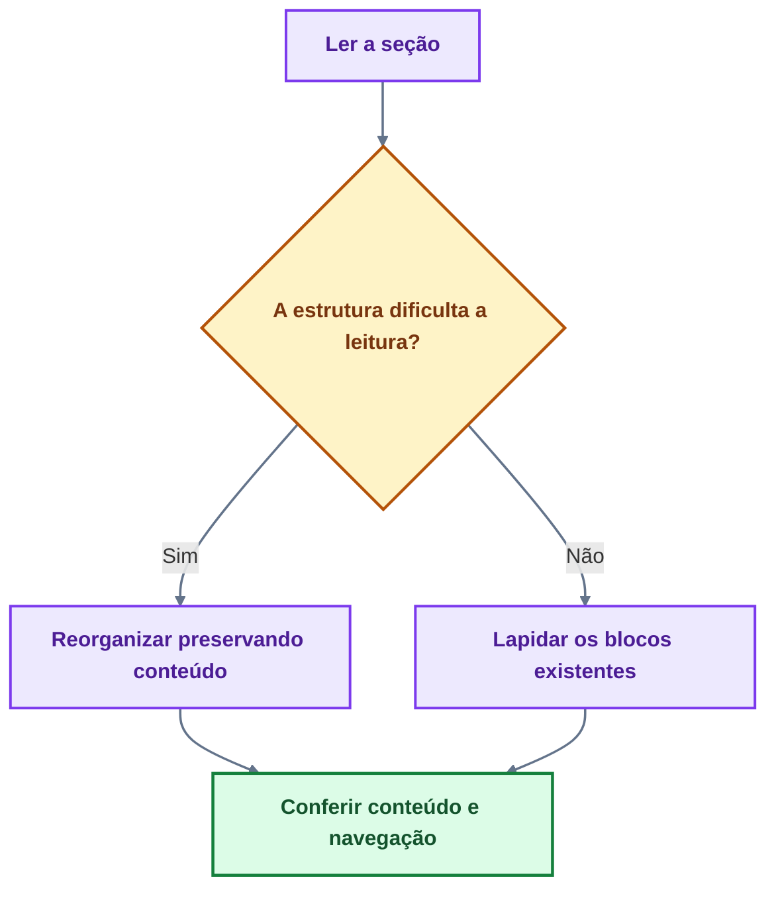
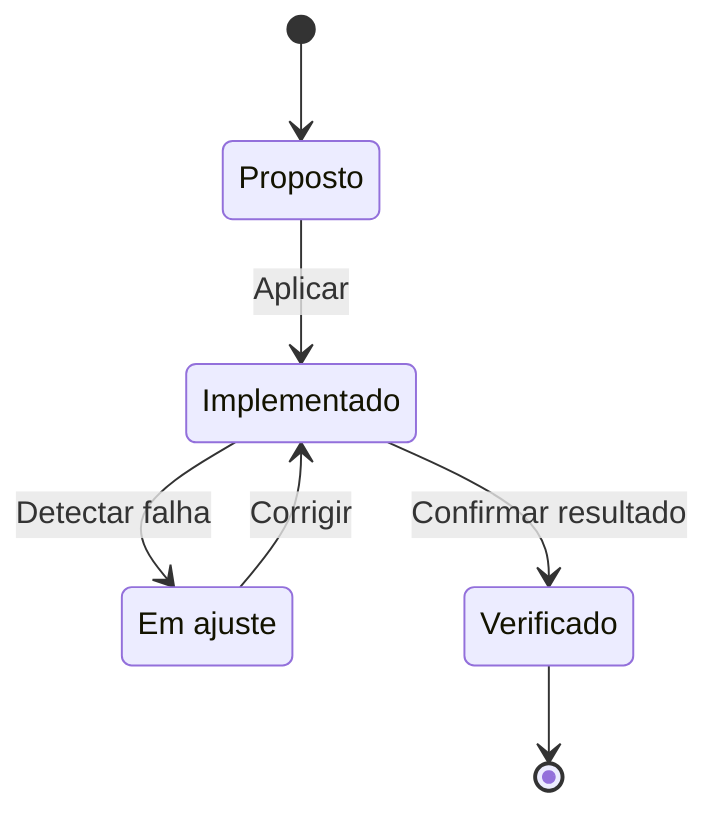
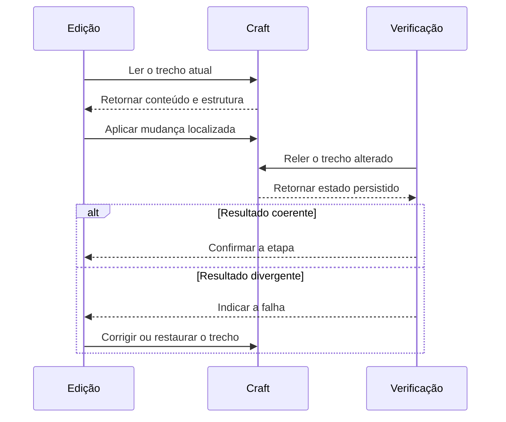

# ⌘ Manual Extenso · Preferências no Craft

*Editorial · Unicode · Tabelas · Mermaid · LaTeX/KaTeX · MCP*

**Espelho git do Craft vivo.** Destino canónico: space **⌕ TUT**, pasta **How to use Craft**, bloco `8db4e12c-f306-4551-49c6-9d7e5fbd5c63`.  
Se este ficheiro divergir do Craft, **Craft vence**. Atualize in place; não crie V2.

> **MANUAL PERSISTENTE · PREFERÊNCIAS DE EDIÇÃO NO CRAFT** — Documento genérico e reutilizável: orienta qualquer pessoa ou IA a criar, revisar e reorganizar notas no Craft neste padrão — editorial, visual, Mermaid e LaTeX. Vale para qualquer tema (não só Medicina). Em conflito, valem: **verdade > beleza**, **zero-loss** e **português impecável**.

JBFS · Referência pessoal de aplicação geral · 13 de setembro de 2026.

Este manual descreve como os documentos devem ser concebidos, escritos, organizados, ilustrados, editados e verificados no Craft. Serve para orientar pessoas e assistentes que trabalhem com as notas, independentemente do assunto, do espaço ou do projeto. O resultado esperado é conteúdo completo, correto, visualmente elaborado, agradável de estudar e fácil de percorrer no iPhone em retrato e no computador.

O padrão combina profundidade e acabamento. Uma nota pode ser extensa e continuar clara quando sua arquitetura distribui bem orientação, explicação, exemplos, imagens, fórmulas e aprofundamentos. Melhorar significa produzir um ganho concreto nessas dimensões, preservando o que já funciona e corrigindo o que estiver errado.

As preferências gerais devem ser adaptadas ao pedido atual e às regras do projeto. Uma restrição localizada, como não criar novas subpáginas em determinada nota, não deve virar uma proibição universal. Da mesma forma, uma autorização para excluir legados de um projeto não se estende automaticamente aos demais.

**Como utilizar.** Ler os princípios e a arquitetura antes de editar; consultar os capítulos específicos para Mermaid, LaTeX, cores ou mídia; usar os critérios de auditoria ao terminar. O apêndice final contém um prompt mestre reutilizável. Há ainda um **Apêndice MCP** operativo para agentes (newline, 502, KaTeX escape).

**Natureza das orientações.** Preferências pessoais definem o resultado desejado. Exemplos e parâmetros propostos ajudam a implementá-lo. Informações sobre o funcionamento do aplicativo dependem da versão e do ambiente; as notas técnicas possuem links para documentação oficial. A presença de um recurso em um manual não substitui sua verificação no destino real.

Manuais irmãos (não substituir): Manual Geral Canónico `0360ff09` · Manual para IAs `04025d1f` · Demonstração Mermaid `6efc0f65` · Demonstração LaTeX/KaTeX `2b2e76d6`.

### Sumário

1. Princípios que orientam todas as notas
2. Escopo, contexto e identidade canónica
3. Arquitetura da informação e página inicial
4. Recursos nativos e escolha do contêiner
5. Toggles verdadeiros e camadas de leitura
6. Escrita editorial, profundidade e ritmo
7. Identidade visual e acabamento avançado
8. Cores reais, paletas e semântica visual
9. Claro, escuro, contraste e paletas de exemplo
10. Recursos não documentados e o caso `undefined`
11. Tipografia, Unicode, títulos e assinatura
12. Leitura no iPhone e no computador
13. Tabelas, comparações e dados estruturados
14. Mermaid como instrumento de raciocínio
15. Mermaid: verticalidade, densidade e semântica
16. Mermaid: sintaxe e validação
17. Modelos de Mermaid para reutilização
18. LaTeX como linguagem matemática e visual
19. LaTeX: composição didática e biblioteca de recursos
20. LaTeX: cores, largura e estabilidade
21. Exemplos de composição em LaTeX
22. Imagens, figuras, infográficos e whiteboards
23. Capas, backdrops e identidade dos espaços
24. Aprendizagem ativa e aplicações por domínio
25. Fontes, evidências e rastreabilidade
26. Execução por etapas e auditoria sem perda
27. Fusão de materiais legados e exclusão
28. Autonomia, comunicação e critérios de conclusão
29. Modelos de arquitetura para adaptar
30. Auditoria rápida de qualidade
31. Particularidades de projetos sem generalização indevida
32. Prompt mestre reutilizável
33. Referências técnicas e vocabulário de revisão
34. Apêndice MCP operativo (agentes)

---

## 1 · Princípios que orientam todas as notas

### 1.1 Conteúdo completo e elaboração real

Documentos que permitam compreender o assunto, estudar com profundidade e retornar rapidamente a uma dúvida. Não basta reunir títulos, listas curtas e um diagrama geral. Cada seção deve desenvolver o raciocínio que seu título promete, apresentar relações e explicar as diferenças importantes.

O nível de aprofundamento acompanha a finalidade. Uma nota de consulta rápida pode ser breve; um atlas, manual ou revisão extensa deve oferecer exposição suficiente, referências, exemplos e recursos visuais proporcionais à complexidade. A preferência por profundidade não autoriza repetições que apenas aumentem o volume.

Em uma lapidação, espera-se melhorias perceptíveis de escrita, organização e apresentação. A troca de cores, a adição de um título ou a multiplicação de negritos não esgota uma solicitação de melhoria editorial. O trabalho deve alcançar os trechos difíceis, as transições, os visuais, os exemplos e o encerramento da nota.

### 1.2 Preservação com correção

O conteúdo válido, os exemplos úteis, as exceções, as imagens relevantes e os avanços já aprovados são patrimônio do documento. Uma edição deve conservá-los ou integrá-los em uma forma demonstravelmente melhor. A aparência de simplicidade não justifica apagar profundidade.

Preservar não significa perpetuar erro. Uma afirmação incorreta deve ser corrigida com base adequada; uma contradição precisa ser resolvida; uma repetição pode ser consolidada quando nenhum detalhe relevante se perder. O princípio de zero-loss se aplica ao valor informacional e funcional, com rastreabilidade das mudanças relevantes.

### 1.3 Hierarquia de prioridades

Em conflitos de implementação, priorizar: a instrução atual → a correção do conteúdo → a preservação dos avanços → a clareza estrutural → a legibilidade → o acabamento visual. Buscar uma solução que satisfaça o conjunto. Quando um recurso visual falhar, corrigir sua implementação e manter o conteúdo acessível.

**Critério de aceitação.** A nova apresentação deve continuar correta quando os estilos forem removidos e continuar utilizável quando o documento for lido em uma tela pequena.

---

## 2 · Escopo, contexto e identidade canónica

### 2.1 Identificar o documento certo

Antes de qualquer edição, confirmar espaço, documento, localização na hierarquia e conteúdo. Títulos semelhantes, datas recentes ou a palavra “oficial” isoladamente não bastam. A nota mais avançada pode não ser a última editada.

Usar links, relações entre páginas, IDs retornados pela conexão, conteúdo presente e instruções atuais. Quando houver dúvida que possa levar à alteração de outro documento, investigar antes de pedir informação objetiva.

### 2.2 Estado vivo como referência operacional

Memórias, exportações, arquivos antigos e relatos anteriores orientam a busca. A edição deve partir da leitura atual do Craft. Comparar o material auxiliar com o que existe e identificar o que já está incorporado, o que falta e o que mudou.

Não confundir uma resposta que expande subpáginas com uma lista de filhos diretos. Um bloco aparecer na leitura de uma página não prova que esteja solto naquela página. Verificar o parentesco real antes de mover, drenar, reorganizar ou excluir.

### 2.3 Continuidade sem documentos concorrentes

Ao continuar uma nota, trabalhar na base canónica. Evitar criar outra matriz, nova versão paralela, cópia de conveniência ou documento homônimo para contornar dificuldades. Um documento novo é adequado quando constitui um novo objeto solicitado.

Não transformar uma restrição antiga em regra permanente quando houver autorização posterior que a substitua. Se um projeto passou a admitir capítulos em cards, utilizar essa autorização dentro daquele projeto. Se uma nota continua limitada a determinadas subpáginas, respeitar esse limite específico.

**Registro operacional útil.** Manter fora do corpo pedagógico a identificação do destino, a região trabalhada, o último estado confirmado e os próximos passos concretos. O leitor da nota deve encontrar conteúdo, não um diário de ferramentas.

---

## 3 · Arquitetura da informação e página inicial

### 3.1 Uma entrada que permita compreender e navegar

A frente principal deve explicar o assunto, delimitar o escopo e tornar visíveis os caminhos de leitura. Um título compacto, uma apresentação breve, uma síntese orientadora e um índice útil geralmente resolvem essa entrada. Evitar repetições da mesma marca ou do mesmo título em vários blocos consecutivos.

Em um atlas, a raiz funciona como ponto de orientação. Os capítulos autônomos podem ocupar páginas ou cards quando isso estiver autorizado. O conteúdo essencial à decisão inicial permanece acessível na entrada; bancos extensos, aprofundamentos e galerias recebem destinos próprios quando a arquitetura pedir.

Se o pedido enfatizar “começar pelo início”, concluir uma melhoria coerente da frente principal antes de percorrer indiscriminadamente todas as subpáginas. Ao mesmo tempo, ler contexto suficiente para não quebrar a lógica do conjunto.

### 3.2 Profundidade com divulgação progressiva

Organizar cada assunto em camadas: orientação, exposição principal, detalhes, exceções, aplicação e revisão. O leitor deve poder avançar gradualmente e também acessar diretamente uma dúvida.

Toggles acomodam conteúdos dependentes; páginas e cards acomodam módulos com autonomia. Não colocar todo parágrafo em um toggle nem transformar todo subtítulo em uma subpágina. A escolha deve reduzir esforço de navegação sem esconder relações importantes.

### 3.3 Numeração e títulos

Numerar quando existir sequência, plano de estudo, referência cruzada ou hierarquia que se beneficie disso. Manter o padrão já consolidado em cada projeto. Uma renumeração ampla exige conferir links, menções, exercícios e títulos dependentes.

Os títulos devem identificar o conteúdo que realmente existe. Evitar títulos grandiosos para seções vazias, abreviações improvisadas e subtítulos tão extensos que percam leitura em retrato. O detalhe cabe na linha de apoio ou na abertura do módulo.

**Pergunta de revisão.** Uma pessoa que abra apenas a página inicial consegue entender o que encontrará, por onde começar e onde localizar o próximo nível de detalhe?

---

## 4 · Recursos nativos e escolha do contêiner

O Craft organiza documentos com blocos e páginas; cards são uma apresentação visual de páginas. Essa distinção ajuda a escolher a estrutura que terá comportamento real no aplicativo.

| Necessidade | Recurso preferido e critério |
| --- | --- |
| Desenvolver um raciocínio | Parágrafos e headings com progressão clara |
| Ocultar uma resposta ou um aprofundamento | Toggle nativo com filhos reais |
| Abrir um capítulo autônomo | Página ou card real com título identificável |
| Comparar valores ou atributos exatos | Tabela estreita com campos equivalentes |
| Destacar uma ressalva ou síntese | Callout ou destaque nativo com função definida |
| Representar relações e decisões | Mermaid quando a topologia acrescentar compreensão |
| Compor uma equação ou análise simbólica | Fórmula nativa em linha ou em bloco (`math_formula`) |
| Mostrar morfologia ou aparência real | Imagem relevante com legenda e atribuição |
| Manter registros filtráveis | Collection quando o volume e a manutenção justificarem |
| Explorar relações espaciais | Whiteboard quando a edição espacial for útil |

### 4.1 Sem simulações enganosas

Um triângulo digitado não cria um toggle. Um retângulo desenhado não cria um card navegável. Texto azul não se torna link sem destino. Escrever uma receita hexadecimal não aplica cor. O resultado precisa usar o recurso correspondente e produzir o comportamento anunciado.

Na ausência temporária de um recurso, uma representação textual pode preservar o conteúdo, mas sua natureza deve estar clara. Ela não deve ser entregue como implementação nativa concluída.

### 4.2 Recursos avançados com propósito

Explorar fontes, cores de texto, highlights, estilos de página, fundos, capas, separadores e cards de maneira integrada. Collections, whiteboards, galerias e outras estruturas são bem-vindos quando resolvem uma necessidade concreta. Evitar introduzi-los apenas para aumentar a quantidade de tipos de bloco.

---

## 5 · Toggles verdadeiros e camadas de leitura

### 5.1 O que é um toggle correto

O título deve ser um bloco recolhível real e seu conteúdo deve pertencer à hierarquia interna desse bloco. Recolher o título precisa ocultar os filhos previstos; expandi-lo deve restituir o conjunto na ordem correta.

Sintaxe MCP obrigatória:

```text
+ Toggle título
  - filho no recuo 1
  + ▸ Gabarito
    - resposta no recuo 2
```

Filho alinhado à esquerda vira bloco solto **fora** do toggle. Cards (`type: page` + `textStyle: card`) **não** levam `listStyle: toggle` — isso é toggle falso (proibido).

### 5.2 Organização interna

O rótulo do toggle deve antecipar o conteúdo: “Como interpretar”, “Por que acontece”, “Exceções”, “Resposta comentada” ou uma pergunta específica. Evitar rótulos repetidos como “Mais”.

Subtoggles são úteis para dividir respostas, situações especiais ou níveis de explicação. Informações necessárias à primeira compreensão ficam expostas. Respostas de exercícios podem ficar recolhidas; o enunciado deve permanecer legível.

### 5.3 Verificação funcional

1. Conferir o título e o tipo do bloco.
2. Confirmar que os blocos subordinados são filhos reais.
3. Verificar que nenhum parágrafo previsto como filho virou irmão.
4. Recolher e expandir quando houver acesso visual ou funcional.
5. Reabrir o trecho e conferir a persistência da hierarquia.

Um toggle tecnicamente verdadeiro ainda pode estar ruim. Também avaliar rótulo, extensão, ordem interna, respiro, posição e pertinência.

---

## 6 · Escrita editorial, profundidade e ritmo

### 6.1 Português e terminologia

Português brasileiro correto, preciso e elegante, com registro acadêmico adequado ao tema. Rever acentuação, concordância, regência, crase, pontuação, siglas e uniformidade de termos. Explicar siglas quando forem introduzidas. Preservar os termos consagrados de cada área quando forem mais precisos.

### 6.2 Parágrafos e transições

Uma ideia principal por parágrafo. Os parágrafos seguintes devem desenvolver causa, consequência, contraste, condição ou aplicação de forma explícita. Listas são apropriadas para elementos paralelos; processos e mecanismos frequentemente precisam de frases que expliquem as relações.

### 6.3 Personalização linha a linha

Avaliar cada bloco: o título descreve o conteúdo? O negrito marca a informação decisiva? A cor tem função? O exemplo está no lugar certo? A transição ficou brusca? O recurso visual acrescenta alguma coisa?

**Resultado esperado.** O texto deve sustentar a leitura contínua, enquanto os destaques permitem revisão rápida sem deformar o raciocínio.

---

## 7 · Identidade visual e acabamento avançado

### 7.1 Linguagem visual desejada

Apresentação acadêmica, elegante, contemporânea e reconhecível. Riqueza visual quando ela organiza o pensamento: cores variadas com função, contraste tipográfico, símbolos discretos, esquemas bem compostos, mídia pertinente e uso competente das possibilidades do Craft.

Sobriedade não deve ser interpretada como ausência de personalidade. O problema está na competição entre elementos, na falta de significado e na perda de leitura.

### 7.2 Sistema coerente por documento

Definir famílias de títulos, tratamento de conceitos, alertas, exemplos, fontes e exercícios. Capítulos podem ter identidade própria, desde que continuem pertencendo ao mesmo sistema. Evitar colocar todos os trechos em negrito ou todos os títulos em cores diferentes.

### 7.3 Explorar e consolidar

Quando o pedido for de estética avançada, investigar recursos disponíveis e exemplos aprovados antes de concluir que algo não pode ser feito. O acabamento inclui a entrada, as páginas intermediárias e o final.

Preferências de página técnicas: tema `prism` ou `techy`; fonte `system-rounded`; washi (`hex` conexões, `wave` fluxo, `stripe` urgência, `dot` revisão).

---

## 8 · Cores reais, paletas e semântica visual

### 8.1 Distinguir o que está sendo colorido

Cor tipográfica, highlight, fundo de bloco, fundo de página, backdrop, cor de card, cor de fórmula e cor de Mermaid são camadas distintas. Se for pedida letra colorida, esperar a cor aplicada ao texto — não um fundo atrás dela.

| Termo | Significado |
| --- | --- |
| Cor real do texto | Cor pertencente ao trecho tipográfico editável |
| Highlight ou proxy | Destaque de fundo ou representação substituta identificada |
| Receita de cor | Valor e função planejados para aplicação |
| Recurso persistido | Propriedade recuperada na leitura posterior |
| Recurso visualmente validado | Resultado inspecionado no ambiente e nas condições declaradas |

### 8.2 Paleta com funções reconhecíveis

Preservar a paleta aprovada do projeto. Sem paleta definida, proposta coerente: azul = conceitos; âmbar = atenção/decisão; verde = ação/confirmação; vermelho = alertas; roxo = síntese/aprofundamento.

**Highlights nativos do MCP** (não existe `orange` nem `brown` simples):

| Highlight | Papel |
| --- | --- |
| `blue` / `gradient-blue` | Navegação / definição |
| `purple` / `gradient-purple` | Mecanismo / síntese |
| `mint` | Evidência / validado |
| `green` | Resultado concreto |
| `yellow` / `gradient-yellow` | Decisão / critério |
| `cyan` | Cautela / transversal |
| `red` / `gradient-red` | Urgência / erro |
| `pink` | Eixo secundário |
| `gradient-brown` | Governança / acervo |
| `gray` | Metadado |

### 8.3 Legenda local e discreta

Quando a nota usar convenções cromáticas recorrentes, explicá-las em uma legenda curta (pode ficar em toggle). Receitas devem registrar função, alvo e par texto/fundo.

---

## 9 · Claro, escuro, contraste e paletas de exemplo

### 9.1 Compatibilidade simultânea

Coerência em modo claro e escuro. Examinar texto, highlights, callouts, tabelas, cards, fórmulas, Mermaid, imagens, capas e separadores. Uma captura em apenas um modo não comprova o outro.

### 9.2 Contraste como critério verificável

WCAG 2.2: contraste mínimo de 4,5:1 para texto comum e 3:1 para texto grande. Medir os pares personalizados e depois observar a composição real.

### 9.3 Pares propostos (exemplos)

| Função e modo | Texto sobre fundo · contraste |
| --- | --- |
| Conceito claro | `#1C3B8E` sobre `#EEF3FF` · 9,15:1 |
| Conceito escuro | `#BFD2FF` sobre `#122344` · 10,28:1 |
| Atenção claro | `#6C4400` sobre `#FFF3D6` · 7,73:1 |
| Atenção escuro | `#FFD887` sobre `#352508` · 10,87:1 |
| Ação claro | `#255421` sobre `#EAF5E7` · 7,90:1 |
| Ação escuro | `#BAE6AC` sobre `#15311A` · 10,09:1 |
| Alerta claro | `#8F211D` sobre `#FCEBEA` · 7,58:1 |
| Alerta escuro | `#FFC8C2` sobre `#401B1B` · 10,28:1 |
| Síntese claro | `#533080` sobre `#F1EBFA` · 8,56:1 |
| Síntese escuro | `#DCCBFA` sobre `#2B1C40` · 10,40:1 |

Cor deve ser acompanhada de palavras, posição ou forma quando comunica significado.

---

## 10 · Recursos não documentados e o caso `undefined`

### 10.1 Preservar o exemplo que funciona

Se houver um exemplo com aparência correta, estudá-lo e preservá-lo antes de qualquer normalização. O termo `undefined` apareceu como parte de possibilidades de formatação que precisam ser compreendidas — investigar o caso real; não assumir sujeira a eliminar.

### 10.2 Não transformar um indício em regra universal

Há diferenças entre campo ausente, valor especial mostrado por ferramenta, representação textual, propriedade herdada e resultado exibido. Em JSON, `undefined` não é valor válido — isso não determina o significado de uma representação vista numa interface. Nunca inventar payload com esse literal.

### 10.3 Protocolo de investigação

1. Localizar e ler o bloco aprovado.
2. Registrar o exemplo completo e sua posição.
3. Separar texto visível das propriedades de cor, highlight e herança.
4. Formular hipótese restrita.
5. Fazer a menor alteração reversível.
6. Comparar estado retornado e resultado visual (claro e escuro).
7. Estender o padrão somente depois de confirmar a reprodução.

### 10.4 Documentar capacidades por evidência

Registrar “observado”, “persistido”, “renderizado” e “validado em determinada plataforma” separadamente.

---

## 11 · Tipografia, Unicode, títulos e assinatura

### 11.1 Expressividade com português íntegro

Títulos elegantes, símbolos bem escolhidos e variações tipográficas Unicode quando forem viáveis. O corpo principal precisa manter conforto de leitura. Acentos e grafia são obrigatórios — não remover acento para encaixar alfabeto estilizado.

### 11.2 Critérios para aceitar um glifo

Conferir leitura, acentuação, aparência em iPhone e desktop, cópia, pesquisa e exportação. Preferir poucos sinais consistentes com função. Evitar emojis decorativos como padrão.

**Repertório seguro (anti-tofu):** `⌁ ⌕ ◇ ◆ ⊹ ⊙ ↳ → ▸ ☑︎ ☒ ⚠︎ ✦`. Proibido: Mathematical Alphanumeric (U+1D400–U+1D7FF), CJK tofu (`〤 〴 〄` em notas novas), Dogra, Linear B, PUA. Legado UCT: `〤` (U+3024) permanece até eleição.

### 11.3 Títulos compactos e completos

Manter o nome principal identificável; qualificadores numa linha de apoio quando necessário.

### 11.4 Autoria

Assinatura preferencial: **JBFS**, discreta. Perfil de referência: [@jairobfs](https://github.com/jairobfs), com hyperlink quando o formato permitir. Evitar repetir a assinatura em cada microbloco.

---

## 12 · Leitura no iPhone e no computador

### 12.1 Retrato como referência

Projetar para leitura real em iPhone na faixa aproximada de 320–430 px. Coluna única, sequência inteligível. Títulos não podem virar faixas de muitas linhas; tabelas não devem exigir arraste constante; diagramas não devem virar miniaturas.

### 12.2 O que revisar em cada módulo

Primeira tela, passagem para o capítulo seguinte, níveis de toggle, largura de tabelas e fórmulas, escala de imagens, acesso a fontes. Cabeçalho de card deve comunicar o assunto antes da abertura.

### 12.3 Coerência no desktop

Evitar usar a preferência por mobile como justificativa para fragmentar excessivamente a nota. Reduzir ramificações e encurtar rótulos é mais robusto que diminuir fontes.

---

## 13 · Tabelas, comparações e dados estruturados

### 13.1 Quando usar tabela

Comparar itens pelos mesmos atributos, mapear critérios, apresentar valores ou organizar registros repetíveis. Preferência: tabelas estreitas (frequentemente duas colunas) no celular. Cabeçalho com highlight `yellow` (ou cor do eixo) + negrito; primeira coluna em negrito.

`--markdown` exige **Enter real** entre linhas. A sequência barra+n quebra (*Markdown must contain exactly one table*).

### 13.2 O que deve ficar fora da tabela

Narrativas longas, raciocínios com muitas condições, explicações de mecanismo. **LaTeX e KaTeX devem ficar fora das tabelas do Craft.**

### 13.3 Collections e tarefas

Usar Collection quando houver volume, filtros, relações ou atualizações recorrentes. Tarefas devem representar ações acompanháveis — não transformar conceito em checkbox.

---

## 14 · Mermaid como instrumento de raciocínio

### 14.1 A função vem antes do código

Mermaid deve tornar relações difíceis mais claras: mecanismos, condições, decisões, dependências, estados, comparações e interações. Antes de escrever a sintaxe, definir a pergunta que o visual resolve.

### 14.2 Seleção do tipo

**Núcleo seguro no Craft:** flowchart, state, sequence, class, ER, `xychart-beta`. **Testar antes:** Gantt, gitgraph, journey, quadrant, mindmap, timeline, Sankey.

| Relação dominante | Tipo |
| --- | --- |
| Decisão ou mecanismo | Flowchart |
| Mudança de condição | State diagram |
| Interação temporal | Sequence diagram |
| Estrutura conceitual | Class diagram |
| Entidades com cardinalidades | ER |
| Valores ao longo de categorias | XY |

### 14.3 Integração com o texto

Introduzir o propósito antes; explicar o que merece atenção depois. Descrição textual equivalente obrigatória. Persistência JSON ≠ prova visual no app.

---

## 15 · Mermaid: verticalidade, densidade e semântica

### 15.1 Orientação e tamanho

Preferência predominante: **TB/TD**. LR excepcional. Dividir mapa quando reunir várias perguntas independentes ou muitos cruzamentos. Proporção alvo ≈ 4:5. Torre máxima ≈ 5–6 níveis; pôster > ~12–15 nós → modularizar.

### 15.2 Formas e setas

Losangos só para decisões reais (perguntas). Setas direcionais com sentido identificável. Família geométrica dominante: angulosa = protocolo; arredondada = mapa.

### 15.3 Cor e hierarquia

`classDef` com fill + stroke + color juntos e opacos. Dual-mode: `--bg-color "#F8FAFC #0F172A"`. Todo nó classificado. `linkStyle` depois da topologia (índices 0-based).

| Papel | fill | stroke | color |
| --- | --- | --- | --- |
| Âncora / entrada | `#E0F2FE` | `#0369A1` | `#0C4A6E` |
| Mecanismo / processo | `#EDE9FE` | `#7C3AED` | `#4C1D95` |
| Decisão | `#FEF3C7` | `#B45309` | `#78350F` |
| Urgência / erro | `#FEE2E2` | `#B42318` | `#7A271A` |
| Resultado / validado | `#DCFCE7` | `#15803D` | `#14532D` |

IDs ASCII; UTF-8 só no rótulo. Quebra = `<br/>` (nunca barra+n no nó).

---

## 16 · Mermaid: sintaxe e validação

### 16.1 Convenções de autoria

IDs técnicos ASCII curtos e estáveis; português completo nos rótulos. Evitar HTML, CSS externo, `click`/callbacks, frontmatter.

### 16.2 Quebras de linha

Preservar quebra legível de rótulos extensos. Se o texto ficar longo: melhorar redação, distribuir na prosa ou dividir o mapa — não reduzir fonte.

### 16.3 Camadas de verificação

1. Conceito · 2. Português · 3. Sintaxe · 4. Persistência · 5. Renderização · 6. Uso (largura, contraste, hierarquia).

Renderização externa ≠ renderização nativa. Declarar exatamente o que foi testado.

---

## 17 · Modelos de Mermaid para reutilização

### 17.1 Decisão sobre profundidade de revisão



### 17.2 Estados de um recurso visual



### 17.3 Interação com verificação e recuperação



---

## 18 · LaTeX como linguagem matemática e visual

### 18.1 Escopo

LaTeX no Craft para equações e composição didática: decompor expressões, alinhar comparações, marcar partes, mostrar transformações. Blocos úteis, elegantes, modulares. Manter alternativa simples quando um recurso não funcionar.

### 18.2 Fórmula em linha e em bloco

Inline `$...$` para notação curta. Bloco `math_formula` para expressões importantes, derivações e alinhamentos. Não presumir delimitadores de outro editor.

### 18.3 LaTeX ≠ KaTeX como garantia

LaTeX é a linguagem; KaTeX é o renderer (subconjunto). Comando válido no TeX completo **não** garante Craft.

---

## 19 · LaTeX: composição didática e biblioteca

### 19.1 Fórmulas com significado explícito

Apresentar a expressão, definir símbolos e unidades **fora** da fórmula, explicar a relação e discutir condições de uso.

### 19.2 Famílias a explorar

Alinhamentos, agrupamentos, chaves explicativas, índices, frações, relações, condições, matrizes pequenas, cancelamentos justificados e destaques localizados. Para cada família: exemplo mínimo, aplicação útil, versão compacta para celular e alternativa de maior compatibilidade.

### 19.3 Gramática de composição

Expressão principal + marcação de partes + interpretação abaixo; ou comparação alinhada destacando só a diferença decisiva. Evitar empilhar todas as possibilidades no mesmo bloco.

### 19.4 Fallback em três níveis

- **A** — renderizada, se o Craft confirmar
- **B** — simplificada, sem mudar a relação
- **C** — leitura linear em português

Tokens: `\begin{gathered}`, `\\[Npt]`, `\color{#hex}{…}`, `\boxed{…}`, `\text{…}`, `\mathbf{…}`, `1{,}0`.

---

## 20 · LaTeX: cores, largura e estabilidade

### 20.1 Cor dentro da fórmula

Usar cores para destacar termos com função explícita. A cor na fórmula não é prova de cor tipográfica nativa no parágrafo.

### 20.2 Mobile e largura

Blocos compactos e alinhamentos verticais. Não usar fórmula como contêiner para todo o capítulo.

### 20.3 Restrições

**Não inserir LaTeX/KaTeX nas tabelas do Craft.** Matrizes matemáticas em blocos de fórmula são outro caso (pequenas). Se uma expressão falhar: reduzir até identificar o comando, preservar cópia do conteúdo correto.

### 20.4 Matriz de capacidades

Registrar recurso, exemplo, ambiente, data e o que foi confirmado: sintaxe, persistência, renderização, claro, escuro, retrato e exportação.

---

## 21 · Exemplos de composição em LaTeX

Fontes didáticas copiáveis. Inserção no Craft: bloco `math_formula`.

### 21.1 Relação proporcional

```tex
\begin{gathered}
v = \frac{d}{t}
\end{gathered}
```

**Leitura:** v é a razão entre distância d e intervalo t (t ≠ 0). Unidades fora da fórmula.

### 21.2 Alinhamento

```tex
\begin{aligned}
3(x + 2) &= 3x + 6 \\
3x + 6 &= 3x + 2 + 4
\end{aligned}
```

### 21.3 Marcação

```tex
\underbrace{a + a + a}_{\text{três parcelas}} = 3a
```

### 21.4 Cor localizada

```tex
\textcolor{#1C3B8E}{x} + 2 = 5
```

---

## 22 · Imagens, figuras, infográficos e whiteboards

### 22.1 Imagens que ensinam

Função didática clara. No **ponto de leitura** (não no fim). Preservar imagens relevantes, legendas, fontes e créditos. `alt` descritivo; frase **Como ler** sem spoiler em questão.

### 22.2 Legenda e leitura dirigida

Informar o que está representado e o que observar. Texto alternativo descreve a informação relevante.

### 22.3 Infográficos e transparência

Fundo transparente quando o recorte exigir. Para diagramas exatos, preferir ferramentas determinísticas. Imagens geradas por IA não substituem diagrama relacional nem exame real.

### 22.4 Whiteboards

Usar quando o ganho estiver em explorar relações espaciais. Testar a interação real.

---

## 23 · Capas, backdrops e identidade dos espaços

### 23.1 Capa ambiental

Wallpaper atmosférico, baixa densidade, muito respiro. Formato quadrado 1:1 como preferência de partida. Texto ausente por padrão.

### 23.2 Capa de documento e card

Considerar o título que o Craft sobrepõe, o recorte e o tamanho do card. Cover ≠ figura de ensino.

### 23.3 Backdrop e contraste

O backdrop deve sustentar a leitura. Conferir em claro e escuro.

---

## 24 · Aprendizagem ativa e aplicações por domínio

### 24.1 Exposição antes da cobrança

Base conceitual antes dos exercícios. Respostas em toggles nativos com justificativa.

### 24.2 Diagnóstico do erro

Identificar se o erro foi conceitual, de interpretação, de regra, de exceção ou de aplicação.

### 24.3 Preferências para notas médicas

Correção científica atualizada; conectar estrutura, fisiologia, mecanismo, manifestações, investigação, diagnóstico, tratamento, prognóstico e complicações conforme o assunto. Não inventar epidemiologia nem protocolos universais.

### 24.4 Linguagens e outros campos

Ligar forma, relação, função e efeito de sentido. O sistema visual é geral; a organização conceitual respeita cada área.

---

## 25 · Fontes, evidências e rastreabilidade

Afirmações sensíveis precisam de fontes adequadas e data. Links descritivos; créditos de imagens preservados. Separar exemplo ilustrativo de dado real. Este manual: preferências pessoais + critérios editoriais; a documentação não certifica o comportamento de uma nota ainda não inspecionada.

---

## 26 · Execução por etapas e auditoria sem perda

### 26.1 Antes de editar

Ler o trecho e contexto; mapear conteúdo válido e dependências; registrar o que será preservado.

### 26.2 Durante

Trabalhar por regiões e lotes recuperáveis. Alterar o menor conjunto capaz de resolver o problema. Usar IDs confirmados (`rootBlockId` ≠ `documentId`).

### 26.3 Depois de cada etapa crítica

Reler o destino. Diante de sucesso parcial, interromper novos lotes. Não repetir cegamente após timeout.

### 26.4 Regressão e recuperação

Identificar o escopo afetado e restaurar o estado conhecido. Não improvisar uma “versão parecida”.

---

## 27 · Fusão de materiais legados e exclusão

### 27.1 Auditoria de equivalência

Classificar: já incorporados, complementares, conflitantes, obsoletos ou ainda não encontrados.

### 27.2 Incorporação complementar

Integrar no módulo pertinente. Ciclo: **incorporar nativo → eleger a 100% → excluir sem dúvida**.

### 27.3 Exclusão dentro da autorização

Só com autorização explícita e após comprovar equivalência. Autorização de um projeto não se estende a outro. **Não restaurar** TEMP/MASTER da lixeira “para limpar busca”.

---

## 28 · Autonomia, comunicação e critérios de conclusão

### 28.1 Avançar até o resultado

Executar o escopo. Evitar responder só com plano. Perguntas só para dúvidas materiais restantes.

### 28.2 Atualizações úteis

Informar descobertas, mudanças de direção, etapas consolidadas e pendências concretas.

### 28.3 Não encerrar pela aparência de sucesso

Requisição aceita ≠ conteúdo completo. Conferir início, corpo, final, navegação, fórmulas, diagramas, mídia e referências.

### 28.4 Condições mínimas de conclusão

- Destino correto recebeu as mudanças
- Conteúdo prometido presente e desenvolvido
- Hierarquia nativa corresponde à organização
- Sem perda de regras, exemplos, exceções, imagens ou fontes
- Visuais coerentes com o texto e o ambiente verificado
- Leitura em retrato considerada
- Encerramento completo; links corretos
- Limitações descritas sem alegação exagerada

---

## 29 · Modelos de arquitetura para adaptar

### 29.1 Nota de estudo

Entrada → Exposição → Aprofundamento (toggles) → Aplicação → Encerramento.

### 29.2 Atlas ou manual extenso

Página central + módulos autônomos + bibliotecas + manutenção.

### 29.3 Manual de possibilidades visuais

Famílias por função → exemplo mínimo e contextualizado → compatibilidade → alternativa → expansão.

---

## 30 · Auditoria rápida de qualidade

| Dimensão | Pergunta |
| --- | --- |
| Destino | Estou no espaço, documento e módulo corretos? |
| Conteúdo | A seção entrega o que o título promete? |
| Correção | Afirmações, exemplos e relações adequados? |
| Preservação | Algum detalhe válido se perdeu? |
| Estrutura | Cards, páginas e toggles nativos com parentesco correto? |
| Escrita | Português correto e raciocínio contínuo? |
| Cor | A camada de cor solicitada foi aplicada? |
| Contraste | Legível nos modos previstos? |
| Mermaid | Esclarece relação e cabe em retrato? |
| LaTeX | Significado, largura e alternativa robusta? |
| Tabelas | Comparação exata sem compressão excessiva? |
| Imagens | Cada figura ensina algo e preserva fonte? |
| Aprendizagem | Base teórica antes das atividades? |
| Navegação | Links e títulos levam ao esperado? |
| Encerramento | Final presente e bem acabado? |
| Evidência | Conclusão descreve só o confirmado? |

**Falhas que exigem correção:** perda de conteúdo, fórmula quebrada, diagrama com relação errada, acento removido, toggle falso, trecho truncado, imagem desaparecida, link incorreto, alegação sem evidência.

---

## 31 · Particularidades de projetos sem generalização indevida

### 31.1 CPOP e marca

No contexto CPOP, preservar a grafia **CP֍P** quando for a marca aprovada. Não substituir o símbolo central nem acrescentar ™. Assinatura **JBFS** e perfil **@jairobfs**.

| Elemento | Hex |
| --- | --- |
| C inicial | `#1C3B8E` |
| Primeiro P | `#B42620` |
| Símbolo ֍ | `#EEAF3D` |
| P final | `#529F32` |

Esses valores **não** constituem paleta universal para as demais notas.

### 31.2 Arquiteturas particulares

Restrições de páginas, nomes, drenagem e legados pertencem ao respectivo projeto. Não transportar IDs entre projetos.

### 31.3 Medicina e identidade própria

Notas médicas compartilham rigor editorial sem receber a marca CPOP.

### 31.4 O que é geral

Correção, preservação, uso nativo, leitura em retrato, coerência claro/escuro, português íntegro, acabamento completo e verificação honesta.

---

## 32 · Prompt mestre reutilizável

> Destino e objetivo. Trabalhe no documento ou módulo indicado, no espaço correto, e execute integralmente a criação, continuação, revisão ou lapidação solicitada. Identifique a base canónica pelo estado vivo. Não crie versões concorrentes.
>
> Contexto e preservação. Leia o trecho e o contexto. Preserve conteúdo válido, exemplos, exceções, imagens, fontes, fórmulas, diagramas, links, hierarquia e avanços aprovados. Corrija erros com fundamento. Zero-loss ≠ manter informação incorreta ≠ autorização para resumir.
>
> Arquitetura. Organize entrada, progressão, aprofundamentos e encerramento. Páginas/cards reais para módulos autônomos quando autorizados. Toggles nativos com filhos subordinados. Sem triângulos digitados como toggle.
>
> Escrita. Português brasileiro correto, preciso, elegante e didático. Explique relações e mecanismos. Exemplos próximos da exposição; atividades depois da base teórica.
>
> Estética. Recursos avançados do Craft com coerência. Diferencie cor de texto, highlight, fundo, card, fórmula e Mermaid. Se houver exemplo aprovado (inclusive associado a `undefined`), preserve-o e investigue antes de normalizar.
>
> Tipografia. Unicode e símbolos quando melhorarem títulos e forem compatíveis. Preserve acentos. Assinatura JBFS discreta; @jairobfs com hyperlink quando pertinente.
>
> Mobile e temas. iPhone retrato + coerência no desktop. Sem tabelas largas, diagramas minúsculos ou fórmulas extensas. Confira claro e escuro.
>
> Mermaid. Tipo pela relação. Prefira TB/TD. Microdiagramas para densos. Losangos para decisões. IDs ASCII; rótulos em português. Valide sintaxe, persistência e renderização nativa.
>
> LaTeX. Fórmulas e composição didática. Símbolos e unidades fora. Legível em retrato. Sem LaTeX/KaTeX em tabelas. Diferencie linguagem, inserção, persistência e renderização. Para MCP: `--json` + `rawCode` (ver §34).
>
> Mídia e aprendizagem. Imagens no ponto de leitura. Fontes e legendas. Perguntas que retomem o conteúdo, com respostas comentadas.
>
> Execução e conclusão. Regiões e lotes recuperáveis. Releia após etapas críticas. Execute ações já autorizadas. Não exclua fora do escopo. Relato conciso do que mudou, do que foi confirmado e dos limites reais.

---

## 33 · Referências técnicas e vocabulário de revisão

### 33.1 Documentação oficial

- Craft: cards, estilos, Mermaid, fórmulas
- Mermaid: sintaxe de flowcharts
- KaTeX: funções suportadas (sem equivalência automática com Craft)
- W3C: contraste mínimo
- MDN: JSON

Consulta: 13/09/2026. Verificar novamente capacidades que possam ter mudado.

### 33.2 Vocabulário

| Termo | Uso correto |
| --- | --- |
| Canónico | Destino identificado como referência atual |
| Estado vivo | Conteúdo e estrutura lidos no momento |
| Zero-loss | Preservação do valor informacional e funcional válido |
| Antirregressão | Comparação que evita perder avanços |
| Nativo | Recurso real do aplicativo |
| Persistido | Recuperado após a escrita |
| Renderizado | Exibido por um renderizador identificado |
| Validado em retrato | Verificado no contexto de largura declarado |
| Alternativa robusta | Menos dependências frágeis, mesmo conteúdo |
| Concluído | Escopo cumprido e critérios conferidos, com limites explicitados |

---

## 34 · Apêndice MCP operativo (agentes)

Complementa os capítulos anteriores com falhas já pagas via API/MCP.

### 34.1 Newline e GFM

Craft **não** interpreta GFM dentro de `type: text`. Tabela numa linha com barra+n deixa a barra-n visível. `--markdown` precisa de Enter real. Quebra no título da página: `--json` com newline JSON verdadeiro.

### 34.2 Mutação e IDs

- `rootBlockId` ≠ `documentId`. `documents resolve-link` antes de escrever.
- Vários blocos: `blocks add --id <page> --json [ {...}, {...} ]`.
- Remover filho de card: `blocks delete --id <childId>` (`documents delete` **não** tira o filho do card).
- Batch com `;` só se o conteúdo **não** tiver `;` (LaTeX, Mermaid, tabelas).
- Read-back sempre. Preview vazio de tabela pode ser artefato.
- `blocks update --markdown` no primeiro bloco parseado; parágrafos extra nascem como irmãos — **não truncar** núcleos.

### 34.3 Erros, 502 e lixeira

| Sintoma | O que fazer |
| --- | --- |
| `CURSOR_INVALID` | Releer schema; não repetir payload cego |
| Cloudflare 502 / `retry_after` ~60 s | Esperar; repetir o **mesmo** comando |
| `RATE_LIMIT_ERROR` | Parar o lote; retomar do último id confirmado |
| `Cannot modify document in trash` | **Parar.** Restaurar/mover; só então escrever |

### 34.4 Fatals KaTeX e camadas de escape

| Fatal | Correção |
| --- | --- |
| `\[12pt]` como “espaço” | `\[` abre display math; a quebra em ambiente é `\\[12pt]` |
| Unicode solto no math | `\text{porta-balão}` |
| `● ◆ º` e `\Huge` | `\bullet`, palavras, `1^{\circ}` |
| Decimal `1,0` | `1{,}0` |
| `--markdown` com `\begin` / `\frac` / `\text` | JSON/MCP come `\b` `\f` `\t` — usar `--json` + `rawCode` |

| TeX em `rawCode` | JSON do `--json` | String da tool call |
| --- | --- | --- |
| `\begin` | `\\begin` | `\\\\begin` |
| `\frac` | `\\frac` | `\\\\frac` |
| `\text` | `\\text` | `\\\\text` |
| `\\[6pt]` | `\\\\[6pt]` | `\\\\\\\\[6pt]` |
| `\\` (quebra) | `\\\\` | `\\\\\\\\` |

Read-back de `rawCode` deve mostrar `\begin` e `\\[npt]`.

### 34.5 Mapa TUT (IDs curtos)

| ID | Papel |
| --- | --- |
| `8db4e12c` | **este** contrato de preferências |
| `0360ff09` | Manual Geral Canónico |
| `04025d1f` | Manual para IAs |
| `6efc0f65` | Demo Mermaid |
| `2b2e76d6` | Demo LaTeX/KaTeX |
| `9513c7ed` | Design nativo |
| `98d0b5ee` | Imagens via MCP |
| `e4a9218b` | Incorporar via MCP |

### 34.6 Hiperligações específicas

Clique = o bloco que **responde**. Sigla no texto → ficha daquela sigla; mecanismo → portal; «SIGLAS»/índice → catálogo. Proibido mandar termo para o sumário inteiro. Proibido bookmarklet. `--markdown` que resume um núcleo de 60 s é corrupção.

---

*Espelho git de `8db4e12c`. Craft vence. Atualize in place. Identificação editorial: preferências de JBFS · @jairobfs. Edição 13/09/2026.*
